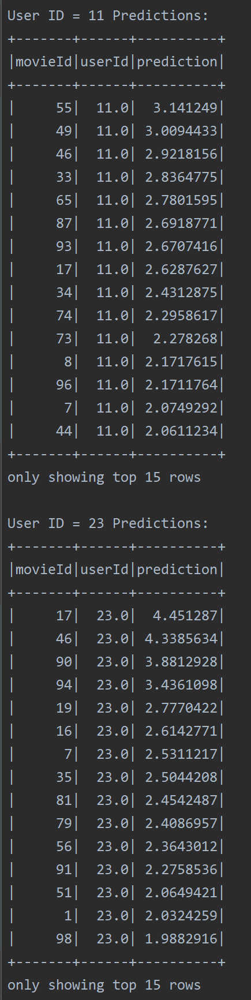
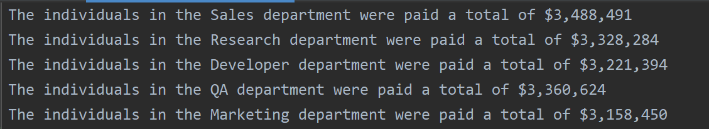
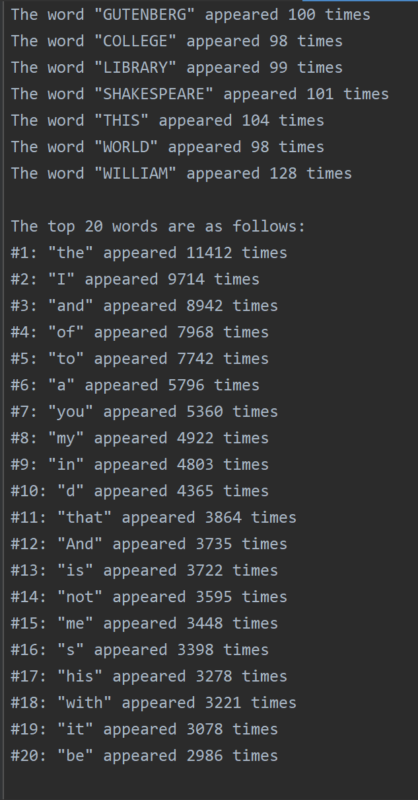
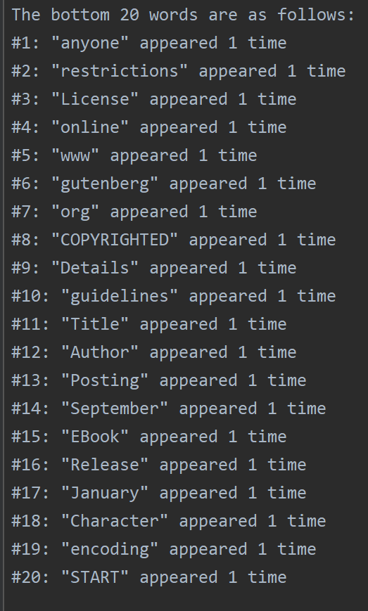
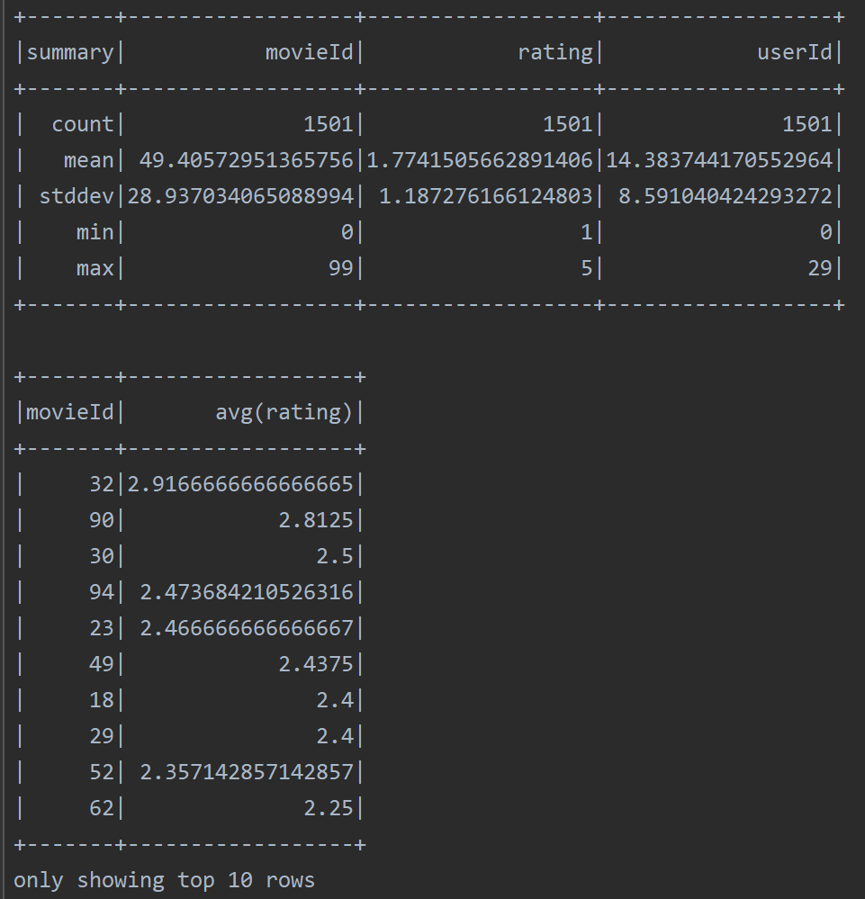
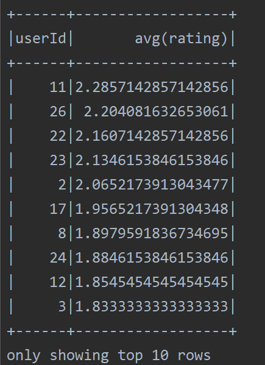
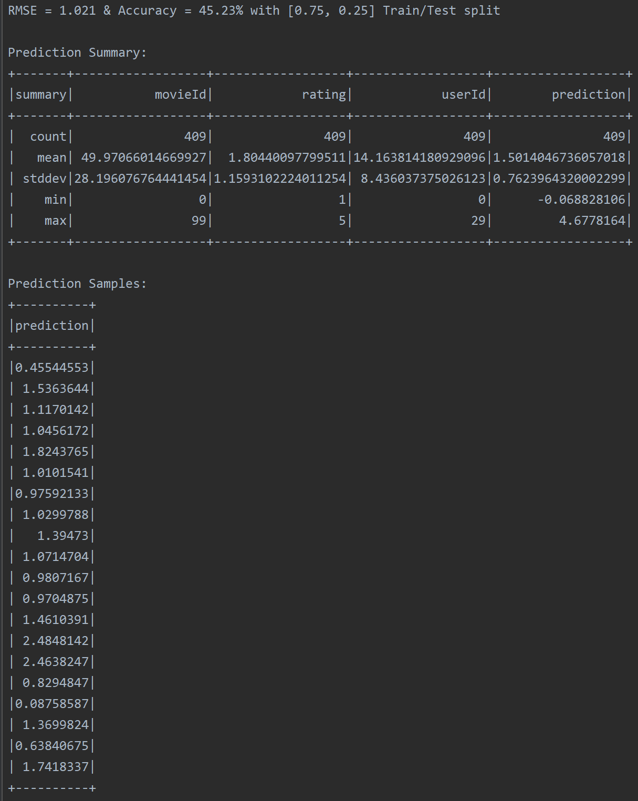
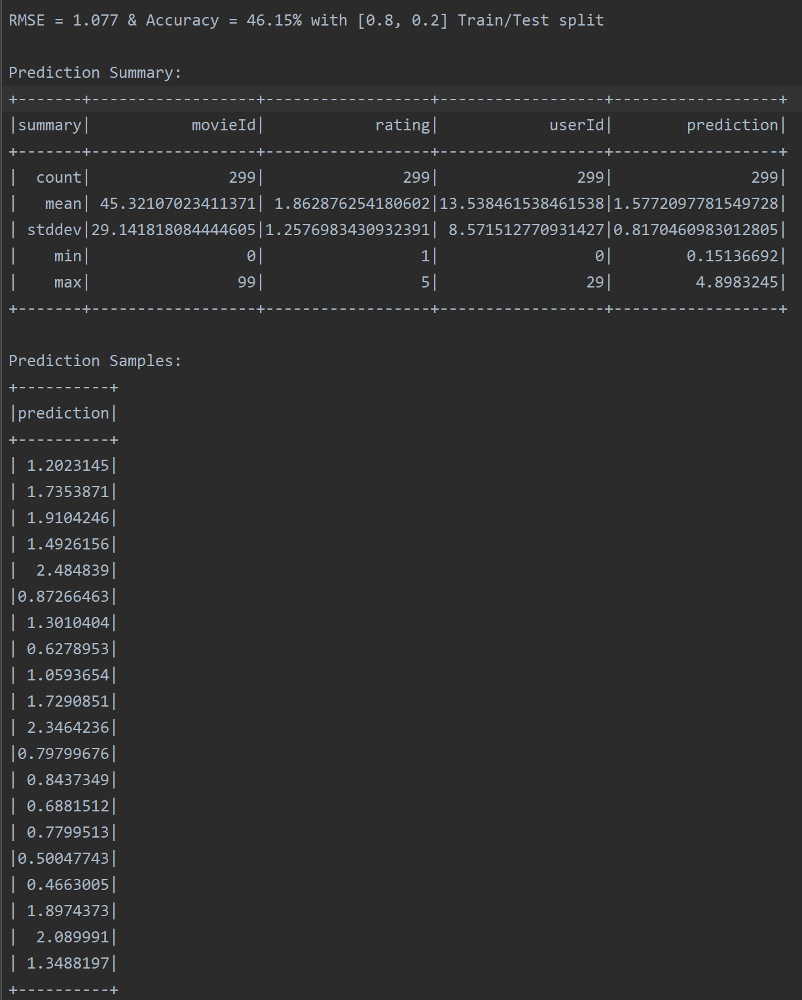
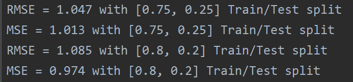
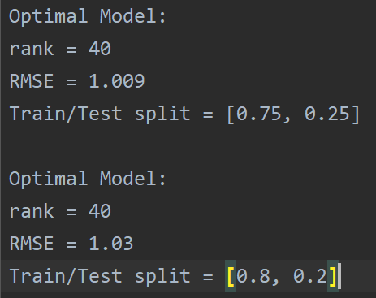

# PySpark Recommender System
## Project Description
The purpose of this project is to become familiar with big data processing tools, specifically, PySpark. Through the large-scale collaborative-filtering project and mini-applications implemented in this repo, I was able to gain a solid understanding of data handling and model formulation using PySpark. 

In this repository, I implement simple map-reduce programs for counting odd/even integers, counting words in a text document, and calculating simple properties present in a supplied large data-frame. 

I also implement a large-scale collaborative-filtering recommender system. This system takes in user rating data pertaining to various movie IDs and models the relationship between the users by utilizing the collaborative filtering approach with alternating least squares (ALS). 

## Setup
### Organization
The scripts for each of the PySpark applications are present in the ```scripts/``` folder. The results for each of the implementations are in the ```results/``` folder. These results have also been appended to the end of the README in image format. The outputs from each script have been included in the ```outputs/``` folder. 
### Conda Environment Setup
**Create environment from environment.yml**:  
*From base directory:*  
```conda env create -f ./environment.yml```

**Update environment from environment.yml**:  
*From base directory and after activating existing environment:*  
```conda env update --file ./environment.yml```

### Execution
After creating a conda environment using the supplied ```environment.yml``` file, inspect the files within the ```scripts/``` folder to understand the purpose of each PySpark application. Then, simply run each of the scripts and observe the output. 

*NOTE: the ```recommender_sys.py``` file has a ```question``` flag that enables different branches of the script to run. Be sure to set this flag if you wish to control the flow of the script*

## Insights
### RMSE vs. MSE
The mean-squared error (MSE) is the mean of the squared difference between the predictions and the targets. The root mean-squared error (RMSE) is the square root of the MSE. The difference between these two metrics is subtle. When the error gets large, the MSE penalizes this difference more aggressively than the RMSE because the RMSE is the square root of the MSE. Furthermore, when the error is less than 1, the MSE penalizes the difference between the actual and the predicted less aggressively than the RMSE. 

In our context, we wish to heavily punish the model if it predicts outlandish ratings that are far away from the true value. Furthermore, we also wish to "go easy" on the model when it is within a star. Therefore, the MSE would be a good choice in this situation. Also, since RMSE requires taking the square root of
the MSE, this may result in minor timing disadvantages. 

### ALS Parameter Tuning
The parameters that I focused on for tuning were rank, regParam, and alpha. Rank is the total number of latent factors used by the model. The default value for rank is 10. After reading online that rank can vary from 5-200, I chose to test the following rank values: ```[5, 10, 20, 40, 80]```. The regParam is the regularization parameter used by the ALS model. I decided to vary the regularization parameter using the following values: ```[0.1, 0.01, 0.001]```. These are typical values used for regularization in other applications. Furthermore, after reading a little bit about other PySpark recommender systems, these values seemed to be commonplace. I also decided to vary the alpha parameter. This parameter controls the implicit feedback variant of ALS. It determines the model's baseline confidence with respect to its observations. I decided to vary this model using these values: ```[2, 3]```. Using the built-in PySpark libraries, grid-search was conducted and an optimal model was extracted from these parameters for train/test splits of 75/25 and 80/20. 

### User-Specific Movie Recommendations
Using the optimal model from the grid-search, movie recommendations were made for the user with ID 11 and the user with ID 23. Note that the movies that these two users had already reviewed were removed from the input data so that already seen movies weren't recommended. These results are illustrated below:




## Result Images
### A.1 Odds/Evens


### A.2 Salary Department


### A.3 & A.4 MapReduce Word Count



### B.1 Describe + Top 10 Movies/Users



### B.2 Collaborative Filtering Initial Implementation



### B.3 RMSE vs. MSE


### B.4 Collaborative Filtering CV


### B.5 Top 15 Movies for User 11 and User 23

